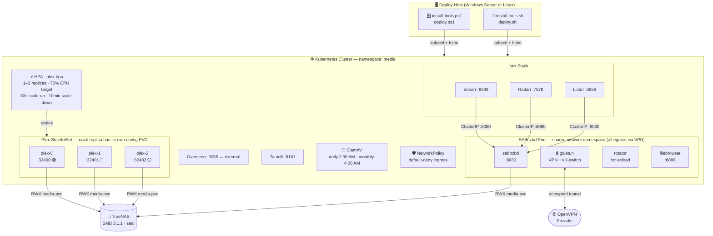

<<<<<<< HEAD
# 🎬 Arrs Kube Plex Nest — Self-Hosted Kubernetes Media Server

A production-ready Helm chart for a complete self-hosted media server stack, designed for **TrueNAS SMB storage** and deployable from **Windows Server or Linux**.

> **New to this?** Open [`setup-guide.html`](setup-guide.html) in any browser for a visual step-by-step walkthrough with an architecture diagram.
>
> **Release history:** See [CHANGELOG.md](CHANGELOG.md) for details on the latest chart updates.

---

## What's Included

| Service | Image | Purpose |
|---------|-------|---------|
| **Plex** | `lscr.io/linuxserver/plex` | Media server — autoscales 1–3 replicas via HPA |
| **SABnzbd** | `lscr.io/linuxserver/sabnzbd` | Usenet downloader — all traffic routed through VPN |
| **gluetun** | `ghcr.io/qdm12/gluetun` | VPN sidecar (OpenVPN) with kill-switch |
| **Sonarr** | `lscr.io/linuxserver/sonarr` | TV show automation |
| **Radarr** | `lscr.io/linuxserver/radarr` | Movie automation |
| **Lidarr** | `lscr.io/linuxserver/lidarr` | Music automation |
| **Overseerr** | `lscr.io/linuxserver/overseerr` | Media request management |
| **Tautulli** | `lscr.io/linuxserver/tautulli` | Plex analytics |
| **ClamAV** | `clamav/clamav` | Daily + monthly antivirus scans with webhook alerts |
| **filebrowser** | `filebrowser/filebrowser` | Web UI for uploading `.ovpn` files |

---

## Architecture

```
                        ┌─────────────────────── namespace: media ─────────────────────────┐
                        │                                                                    │
  ⚡ HPA (1–3 replicas) │   ┌──────────┐  ┌──────────┐  ┌──────────┐                     │
   targeting 70% CPU ──►│   │  plex-0  │  │  plex-1  │  │  plex-2  │  (StatefulSet)       │
                        │   │  :32400  │  │  :32401  │  │  :32402  │  each has own PVC    │
                        │   └────┬─────┘  └────┬─────┘  └────┬─────┘                     │
                        │        └──────────────┴──────────────┘                           │
                        │                       │ media-pvc (RWX · SMB · TrueNAS)          │
                        │   ┌───────────────────┴────────────────────────────────────┐     │
                        │   │  SABnzbd Pod (shared network namespace)                │     │
                        │   │  ┌──────────┐ ┌──────────┐ ┌──────────┐ ┌──────────┐ │     │
                        │   │  │ gluetun  │ │ sabnzbd  │ │ rotator  │ │filebrowsr│ │     │
                        │   │  │  VPN+KS  │ │  :8080   │ │ interval │ │  :8888   │ │     │
                        │   │  └──────────┘ └──────────┘ └──────────┘ └──────────┘ │     │
                        │   │  All egress exits via VPN · RFC-1918 bypasses tunnel  │     │
                        │   └────────────────────────────────────────────────────────┘     │
                        │                                                                    │
                        │   Sonarr :8989  Radarr :7878  Lidarr :8686                       │
                        │   Overseerr :5055 (external)  Tautulli :8181                     │
                        │   ClamAV CronJobs (daily 2:30 AM · monthly 4:00 AM 1st)          │
                        └────────────────────────────────────────────────────────────────────┘
```

**Key design decisions:**
- Plex runs as a **StatefulSet** (not Deployment) so each HPA replica gets its own `/config` PVC — avoids RWO PVC conflicts
- SABnzbd's VPN is scoped to the pod only — other services are unaffected
- VPN rotation interval is **hot-reloadable** via ConfigMap without restarting pods
- All container images are Linux-only; `nodeSelector: kubernetes.io/os: linux` ensures they land on Linux nodes even in mixed clusters

---

## Prerequisites

- **Kubernetes cluster** with at least one Linux worker node (k3s, kubeadm, RKE2, etc.)
- **TrueNAS** (or other NAS) with an SMB share accessible from the cluster
- **OpenVPN provider** account (tested with PrivadoVPN — any provider that supplies `.ovpn` files works)
- **kubectl** and **helm** on the machine you're deploying from

---

## Quick Start

### Clone the repo
=======
<div align="center">


**Self-hosted Kubernetes media server — Plex autoscaling · SABnzbd + VPN · *arrs · ClamAV · TrueNAS SMB**

<br/>

[](https://helm.sh/docs/helm/helm_install/)
[](https://kubernetes.io)
[](#)
[](#-quick-start)
[](LICENSE)

<br/>

> Open [`setup-guide.html`](setup-guide.html) locally for the full visual walkthrough with interactive architecture diagram.

</div>

---

## 📦 What's Included

<table>
<tr><th></th><th>Service</th><th>Purpose</th></tr>
<tr><td>🎬</td><td><b>Plex</b></td><td>Media server — autoscales 1–3 replicas via HPA</td></tr>
<tr><td>📥</td><td><b>SABnzbd</b></td><td>Usenet downloader — all traffic routed through VPN</td></tr>
<tr><td>🔒</td><td><b>gluetun</b></td><td>OpenVPN sidecar with kill-switch (scoped to SABnzbd pod only)</td></tr>
<tr><td>📺</td><td><b>Sonarr</b></td><td>TV show automation</td></tr>
<tr><td>🎥</td><td><b>Radarr</b></td><td>Movie automation</td></tr>
<tr><td>🎵</td><td><b>Lidarr</b></td><td>Music automation</td></tr>
<tr><td>🌐</td><td><b>Overseerr</b></td><td>Media request management (external access)</td></tr>
<tr><td>📊</td><td><b>Tautulli</b></td><td>Plex analytics &amp; monitoring</td></tr>
<tr><td>🦠</td><td><b>ClamAV</b></td><td>Daily + monthly antivirus scans with webhook alerts</td></tr>
<tr><td>📁</td><td><b>filebrowser</b></td><td>Web UI for uploading <code>.ovpn</code> files to the VPN pod</td></tr>
</table>

---

## 🏗️ Architecture



<details>
<summary><b>Key design decisions</b></summary>

<br/>

- 🎯 **Plex as StatefulSet** — each autoscaled replica gets its own `/config` PVC, avoiding RWO conflicts
- 🔒 **VPN kill-switch scoped to one pod** — only SABnzbd traffic goes through gluetun; *arrs reach SABnzbd via ClusterIP (RFC-1918 bypass)
- 🔄 **Hot-reload VPN rotation** — change interval via `kubectl edit configmap vpn-config`, no pod restart needed
- 🐧 **`nodeSelector: kubernetes.io/os: linux`** — safe on all-Linux clusters, required on mixed Windows/Linux nodes

</details>

---

## ✅ Prerequisites

- Kubernetes cluster with at least one Linux worker node (k3s · kubeadm · RKE2)
- NAS with an SMB share accessible from the cluster (TrueNAS SCALE/CORE recommended)
- OpenVPN provider account — any provider that supplies `.ovpn` files (tested: PrivadoVPN)
- `kubectl` and `helm` — the install scripts handle these for you

---

## 🚀 Quick Start

### 1️⃣ Clone the repo
>>>>>>> 75a4734 (feat: Add Kubernetes manifests for media stack deployment)

```bash
git clone https://github.com/djkidnyce/arrs-kube-plex-nest.git
cd arrs-kube-plex-nest
```

<<<<<<< HEAD
### Windows Server

```powershell
# Step 1: Install or upgrade kubectl + helm (checks for existing installs first)
.\install-tools.ps1

# Step 2: Open a new PowerShell window, then configure kubeconfig
#   Copy from your cluster (k3s example):
#   scp user@<node-ip>:/etc/rancher/k3s/k3s.yaml $env:USERPROFILE\.kube\config
#   Then replace 127.0.0.1 with your node IP if needed

# Step 3: Deploy
.\deploy.ps1                        # interactive
.\deploy.ps1 -Namespace media       # custom namespace
.\deploy.ps1 -DryRun                # preview only
```

### Linux

```bash
# Step 1: Install or upgrade kubectl + helm (checks for existing installs first)
chmod +x install-tools.sh deploy.sh
./install-tools.sh

# Step 2: Configure kubeconfig (k3s example)
mkdir -p ~/.kube
scp user@<node-ip>:/etc/rancher/k3s/k3s.yaml ~/.kube/config
chmod 600 ~/.kube/config

# Step 3: Deploy
./deploy.sh                         # interactive
./deploy.sh -n media                # custom namespace
./deploy.sh --dry-run               # preview only
```

> Both scripts will prompt you for SMB credentials, Plex claim token, VPN credentials, and a ClamAV webhook URL. Passwords are entered as hidden prompts and are never written to disk.

---

## Configuration

The deploy scripts prompt for NAS host, share name, and all credentials interactively — you don't need to edit `values.yaml` for those. Other key settings:

```yaml
# NAS / TrueNAS SMB share
# nas.host and nas.mediaShare are collected by the deploy script at runtime.
# You can also pass them directly:
#   helm upgrade --install akpn . --set nas.host=192.168.1.100 --set nas.mediaShare=media
nas:
  host: ""           # set via deploy script prompt
=======
---

### 2️⃣ Install or upgrade kubectl & helm

> Both scripts check your **existing versions first** — if already up to date, they do nothing. If a newer version is available, they prompt you to upgrade.

<details>
<summary><b>🪟 Windows Server (PowerShell as Administrator)</b></summary>

<br/>

```powershell
# One-time: allow local scripts to run
Set-ExecutionPolicy RemoteSigned -Scope CurrentUser

# Check, install, or upgrade kubectl + helm
.\install-tools.ps1

# Force upgrade to latest without prompting (CI / unattended):
.\install-tools.ps1 -Force
```

<table>
<tr><th></th><th>Detail</th></tr>
<tr><td><code>kubectl</code> source</td><td><code>dl.k8s.io</code> — fetches <code>stable.txt</code> for latest version</td></tr>
<tr><td><code>helm</code> source</td><td>GitHub API — <code>github.com/helm/helm/releases/latest</code></td></tr>
<tr><td>Install location</td><td><code>C:\tools\</code> — added to PATH automatically</td></tr>
<tr><td>Upgrade behaviour</td><td>Shows old → new version, prompts <code>[y/N]</code></td></tr>
</table>

> ⚠️ Open a **new PowerShell window** after the script runs so the PATH update takes effect.

</details>

<details>
<summary><b>🐧 Linux (bash)</b></summary>

<br/>

```bash
chmod +x install-tools.sh
./install-tools.sh            # interactive
./install-tools.sh --force    # always upgrade without prompting
./install-tools.sh --dir ~/bin  # custom install directory
```

<table>
<tr><th></th><th>Detail</th></tr>
<tr><td><code>kubectl</code> source</td><td><code>dl.k8s.io</code> — fetches <code>stable.txt</code> for latest version</td></tr>
<tr><td><code>helm</code> source</td><td>GitHub API — <code>github.com/helm/helm/releases/latest</code></td></tr>
<tr><td>Install location</td><td><code>/usr/local/bin</code> with sudo · <code>~/bin</code> without</td></tr>
<tr><td>Architecture</td><td>Auto-detected: <code>amd64</code> · <code>arm64</code> · <code>armv7</code></td></tr>
</table>

</details>

---

### 3️⃣ Configure kubeconfig

<details>
<summary><b>🪟 Windows Server</b></summary>

<br/>

```powershell
New-Item -ItemType Directory "$env:USERPROFILE\.kube" -Force

# Copy your kubeconfig from the cluster node
# (WinSCP / USB / shared folder → $env:USERPROFILE\.kube\config)

# If IP is 127.0.0.1 (common with k3s), replace with your node IP:
(Get-Content "$env:USERPROFILE\.kube\config") `
  -replace '127\.0\.0\.1', '<your-node-ip>' `
  | Set-Content "$env:USERPROFILE\.kube\config"

kubectl cluster-info   # verify
```

</details>

<details>
<summary><b>🐧 Linux</b></summary>

<br/>

```bash
mkdir -p ~/.kube

# k3s
scp user@<node-ip>:/etc/rancher/k3s/k3s.yaml ~/.kube/config

# kubeadm
scp user@<node-ip>:/etc/kubernetes/admin.conf ~/.kube/config

# RKE2
scp user@<node-ip>:/etc/rancher/rke2/rke2.yaml ~/.kube/config

chmod 600 ~/.kube/config
kubectl cluster-info   # verify
```

</details>

> ⚠️ The kubeconfig contains cluster admin credentials. Never commit it to git.

---

### 4️⃣ Deploy

<details>
<summary><b>🪟 Windows Server</b></summary>

<br/>

```powershell
cd arrs-kube-plex-nest

.\deploy.ps1              # interactive deploy
.\deploy.ps1 -DryRun      # preview manifests only
.\deploy.ps1 -Namespace media -ValuesFile my-values.yaml
```

</details>

<details>
<summary><b>🐧 Linux</b></summary>

<br/>

```bash
cd arrs-kube-plex-nest

./deploy.sh               # interactive deploy
./deploy.sh --dry-run     # preview manifests only
./deploy.sh -n media -f my-values.yaml
```

</details>

The deploy script will prompt for:

<table>
<tr><th>Prompt</th><th>Notes</th></tr>
<tr><td>🖥️ NAS host IP or hostname</td><td>Your TrueNAS address — never stored in any file</td></tr>
<tr><td>📁 SMB share name</td><td>Share name on the NAS (default: <code>media</code>)</td></tr>
<tr><td>📏 Share size quota</td><td>Must match your NAS quota (default: <code>10Ti</code>)</td></tr>
<tr><td>👤 SMB username + password</td><td>Stored as a Kubernetes Secret — never written to disk</td></tr>
<tr><td>🎬 Plex claim token</td><td>Get one at <a href="https://plex.tv/claim">plex.tv/claim</a> — valid 4 minutes</td></tr>
<tr><td>🔒 VPN username + password</td><td>Stored as <code>openvpn.cred</code> Secret (mode <code>0400</code>)</td></tr>
<tr><td>🔔 ClamAV webhook URL</td><td>ntfy · Discord · Slack · Gotify — leave blank to skip</td></tr>
</table>

> 🔐 All password prompts are hidden (`Read-Host -AsSecureString` / `read -s`). Values go directly into `kubectl create secret` and are **never written to disk**.

---

## ⚙️ Configuration

Edit `values.yaml` to customise the stack. Key settings:

```yaml
# NAS — prompted at deploy time; can also be passed directly:
#   helm upgrade --install akpn . --set nas.host=192.168.1.100 --set nas.mediaShare=media
nas:
  host: ""              # set by deploy script prompt
>>>>>>> 75a4734 (feat: Add Kubernetes manifests for media stack deployment)
  mediaShare: "media"

# Plex autoscaling
plex:
  autoscaling:
    enabled: true
    minReplicas: 1
    maxReplicas: 3
    targetCPUUtilizationPercentage: 70
<<<<<<< HEAD

# VPN rotation (0 = disabled; change live via: kubectl edit cm vpn-config)
vpn:
  rotationIntervalSeconds: "3600"

# ClamAV notifications
clamav:
  enabled: true
  notificationType: "ntfy"   # ntfy | discord | slack | gotify | generic
```

See `values.yaml` for the full reference including resource limits and storage sizes.

---

## Services & Ports

| Service | Port | External? | Notes |
|---------|------|-----------|-------|
| `plex-0` | 32400 | ✅ LoadBalancer | Always running |
| `plex-1` | 32401 | ✅ LoadBalancer | HPA scale-up |
| `plex-2` | 32402 | ✅ LoadBalancer | HPA scale-up |
| `seerr` (Overseerr) | 5055 | ✅ LoadBalancer | Request management |
| `sabnzbd` | 8080 | ClusterIP | Port-forward to access |
| `sabnzbd-filebrowser` | 8888 | ClusterIP | Upload `.ovpn` files here |
| `sabnzbd-vpn` | 8000 | ClusterIP | gluetun control API |
| `sonarr` | 8989 | ClusterIP | |
| `radarr` | 7878 | ClusterIP | |
| `lidarr` | 8686 | ClusterIP | |
| `tautulli` | 8181 | ClusterIP | |

Port-forward any ClusterIP service to your local machine:
```bash
=======
    scaleUpStabilizationSeconds: 30     # fast spin-up
    scaleDownStabilizationSeconds: 600  # 10 min cooldown

# VPN rotation (0 = disabled)
# Change live without restarting pods:
#   kubectl edit configmap vpn-config -n media
vpn:
  rotationIntervalSeconds: "3600"

# ClamAV
clamav:
  enabled: true
  notificationType: "ntfy"   # ntfy | discord | slack | gotify | generic
  notifyOnClean: "false"     # true = notify even on clean scans
```

---

## 🔌 Services & Ports

<table>
<tr><th>Service</th><th>Port</th><th>Access</th><th>Notes</th></tr>
<tr><td><code>plex-0</code></td><td><code>32400</code></td><td>🌐 LoadBalancer</td><td>Always running</td></tr>
<tr><td><code>plex-1</code></td><td><code>32401</code></td><td>🌐 LoadBalancer</td><td>HPA scale-up</td></tr>
<tr><td><code>plex-2</code></td><td><code>32402</code></td><td>🌐 LoadBalancer</td><td>HPA max load</td></tr>
<tr><td><code>seerr</code> (Overseerr)</td><td><code>5055</code></td><td>🌐 LoadBalancer</td><td>Media request UI</td></tr>
<tr><td><code>sabnzbd</code></td><td><code>8080</code></td><td>🔒 ClusterIP</td><td>Port-forward to access</td></tr>
<tr><td><code>sabnzbd-filebrowser</code></td><td><code>8888</code></td><td>🔒 ClusterIP</td><td>Upload <code>.ovpn</code> files</td></tr>
<tr><td><code>sabnzbd-vpn</code></td><td><code>8000</code></td><td>🔒 ClusterIP</td><td>gluetun control API</td></tr>
<tr><td><code>sonarr</code></td><td><code>8989</code></td><td>🔒 ClusterIP</td><td></td></tr>
<tr><td><code>radarr</code></td><td><code>7878</code></td><td>🔒 ClusterIP</td><td></td></tr>
<tr><td><code>lidarr</code></td><td><code>8686</code></td><td>🔒 ClusterIP</td><td></td></tr>
<tr><td><code>tautulli</code></td><td><code>8181</code></td><td>🔒 ClusterIP</td><td></td></tr>
</table>

```bash
# Get all service IPs after deploy
kubectl get svc -n media

# Access any ClusterIP service locally
>>>>>>> 75a4734 (feat: Add Kubernetes manifests for media stack deployment)
kubectl port-forward svc/sabnzbd-filebrowser 8888:8888 -n media
```

---

<<<<<<< HEAD
## Post-Deploy Steps

1. **Upload `.ovpn` file** — port-forward the filebrowser, log in (default `admin`/`admin`, change immediately), upload your provider's `.ovpn` file
2. **Restart SABnzbd** — `kubectl rollout restart deployment/sabnzbd -n media`
3. **Claim Plex** — visit `http://<plex-0-lb-ip>:32400/web`, use the claim token you entered during deploy (get a fresh one at https://plex.tv/claim — valid 4 min)
4. **Connect Sonarr/Radarr to SABnzbd** — host: `sabnzbd.media.svc.cluster.local`, port `8080`, API key from SABnzbd settings
5. **Verify VPN** — `kubectl port-forward svc/sabnzbd-vpn 8000:8000 -n media`, then `curl http://localhost:8000/v1/openvpn/status`

---

## VPN Rotation

Change the rotation interval at any time **without restarting pods**:
```bash
kubectl edit configmap vpn-config -n media
# Edit rotation-interval-seconds (0 = disabled)
```
The `vpn-rotator` container re-reads the file on every loop iteration.

---

## ClamAV Alerts

The scan script supports four notification platforms. Set `clamav.notificationType` in `values.yaml`:

| Platform | Webhook URL format |
|----------|--------------------|
| `ntfy` | `https://ntfy.sh/YOUR_TOPIC` |
| `discord` | `https://discord.com/api/webhooks/...` |
| `slack` | `https://hooks.slack.com/services/...` |
| `gotify` | `https://your-gotify/message?token=...` |
| `generic` | Any HTTP POST endpoint |

Run a manual scan immediately:
```bash
=======
## 📋 Post-Deploy Checklist

- [ ] **Upload `.ovpn` file** — port-forward filebrowser (`kubectl port-forward svc/sabnzbd-filebrowser 8888:8888 -n media`), log in (`admin`/`admin` → change immediately), upload your provider's `.ovpn` file
- [ ] **Restart SABnzbd** — `kubectl rollout restart deployment/sabnzbd -n media`
- [ ] **Claim Plex** — visit `http://<plex-0-lb-ip>:32400/web`, use claim token from deploy (fresh token: [plex.tv/claim](https://plex.tv/claim))
- [ ] **Connect Sonarr/Radarr to SABnzbd** — host: `sabnzbd.media.svc.cluster.local`, port `8080`, API key from SABnzbd → Settings → General
- [ ] **Verify VPN** — `kubectl port-forward svc/sabnzbd-vpn 8000:8000 -n media` → `curl http://localhost:8000/v1/openvpn/status`
- [ ] **Check Plex HPA** — `kubectl get hpa plex-hpa -n media` (TARGETS column should show a `%`, not `<unknown>`)
- [ ] **Test ClamAV** — `kubectl create job --from=cronjob/clamav-daily test-scan -n media`

---

## 🔄 VPN Rotation

Change the rotation interval **without restarting any pods**:

```bash
kubectl edit configmap vpn-config -n media
# Edit rotation-interval-seconds  (0 = disabled)
```

The `vpn-rotator` container re-reads the file on every loop iteration — no restart needed.

---

## 🦠 ClamAV Alerts

Set `clamav.notificationType` in `values.yaml` to match your webhook platform:

<table>
<tr><th>Platform</th><th>Webhook URL format</th></tr>
<tr><td><code>ntfy</code></td><td><code>https://ntfy.sh/YOUR_TOPIC</code></td></tr>
<tr><td><code>discord</code></td><td><code>https://discord.com/api/webhooks/...</code></td></tr>
<tr><td><code>slack</code></td><td><code>https://hooks.slack.com/services/...</code></td></tr>
<tr><td><code>gotify</code></td><td><code>https://your-gotify/message?token=...</code></td></tr>
<tr><td><code>generic</code></td><td>Any HTTP POST endpoint</td></tr>
</table>

```bash
# Trigger a manual scan immediately
>>>>>>> 75a4734 (feat: Add Kubernetes manifests for media stack deployment)
kubectl create job --from=cronjob/clamav-daily manual-scan-$(date +%s) -n media
```

---

<<<<<<< HEAD
## Secrets (never in git)

The deploy scripts create all secrets **imperatively** — they are never written to files. The `templates/secrets.yaml` in this repo contains only `REPLACE_ME` placeholder values and should not be applied directly.

If you need to update a secret later:
```bash
# Update VPN credentials
=======
## 🔒 Secrets — Never in Git

All secrets are created **imperatively** by the deploy scripts — they are never written to files. The `templates/secrets.yaml` in this repo contains only `REPLACE_ME` placeholder values.

To update a secret after deploy:

```bash
# Example: rotate VPN credentials
>>>>>>> 75a4734 (feat: Add Kubernetes manifests for media stack deployment)
kubectl create secret generic vpn-credentials \
  --from-file=openvpn.cred=/path/to/cred-file \
  --namespace=media --dry-run=client -o yaml | kubectl apply -f -
```

---

<<<<<<< HEAD
## Upgrading

```bash
# Pull latest chart changes
git pull

# Check/upgrade your tools first
.\install-tools.ps1    # Windows
./install-tools.sh     # Linux

# Re-deploy (Helm upgrades in-place)
.\deploy.ps1           # Windows
./deploy.sh            # Linux
=======
## ⬆️ Upgrading

```bash
git pull

# Check / upgrade tools first
.\install-tools.ps1   # Windows
./install-tools.sh    # Linux

# Re-deploy (Helm upgrades in-place, preserving secrets)
.\deploy.ps1          # Windows
./deploy.sh           # Linux
>>>>>>> 75a4734 (feat: Add Kubernetes manifests for media stack deployment)
```

---

<<<<<<< HEAD
## Troubleshooting

```bash
# Check all pod status
kubectl get pods -n media

# SABnzbd VPN logs
kubectl logs -l app=sabnzbd -c gluetun -n media --tail=50

# Plex HPA status
kubectl describe hpa plex-hpa -n media

# ClamAV last scan result
kubectl logs -l scan-type=daily -n media --tail=100
```

---

## Contributing

Pull requests welcome. Before submitting:
- Test on a real cluster (`helm template` + `kubectl apply --dry-run=server`)
- Keep secrets out of commits — use the imperative `kubectl create secret` pattern
- For new notification platforms, add them to `files/scripts/scan.sh` and update the docs

---

## License
=======
## 🔧 Troubleshooting

<details>
<summary><b>Check all pod status</b></summary>

```bash
kubectl get pods -n media
```
</details>

<details>
<summary><b>VPN not connecting</b></summary>

```bash
kubectl logs -l app=sabnzbd -c gluetun -n media --tail=50
```
</details>

<details>
<summary><b>Plex HPA shows &lt;unknown&gt; for CPU</b></summary>

```bash
# metrics-server may not be ready yet
kubectl get deployment metrics-server -n kube-system
kubectl describe hpa plex-hpa -n media
```
</details>

<details>
<summary><b>SMB mount failing</b></summary>

```bash
# Check CSI driver pods
kubectl get pods -n kube-system -l app=csi-smb-node
# Check PV/PVC status
kubectl get pv,pvc -n media
```
</details>

<details>
<summary><b>ClamAV scan result</b></summary>

```bash
kubectl logs -l scan-type=daily -n media --tail=100
```
</details>

---

## 🤝 Contributing

Pull requests welcome. Before submitting, test with `helm template . --set nas.host=test` and `kubectl apply --dry-run=server`. Keep all secrets out of commits and use the imperative `kubectl create secret` pattern. For new notification platforms, add them to `files/scripts/scan.sh` and update the docs.

---

## 📄 License
>>>>>>> 75a4734 (feat: Add Kubernetes manifests for media stack deployment)

MIT — see [LICENSE](LICENSE) for details.

---

<<<<<<< HEAD
*Built with Helm v4.x · Tested on k3s · TrueNAS SCALE SMB 3.1.1 + seal*
=======
<div align="center">

Built with ❤️ for the homelab community

[](https://helm.sh)
[](https://plex.tv)
[](https://k3s.io)
[](https://truenas.com)

</div>
>>>>>>> 75a4734 (feat: Add Kubernetes manifests for media stack deployment)
